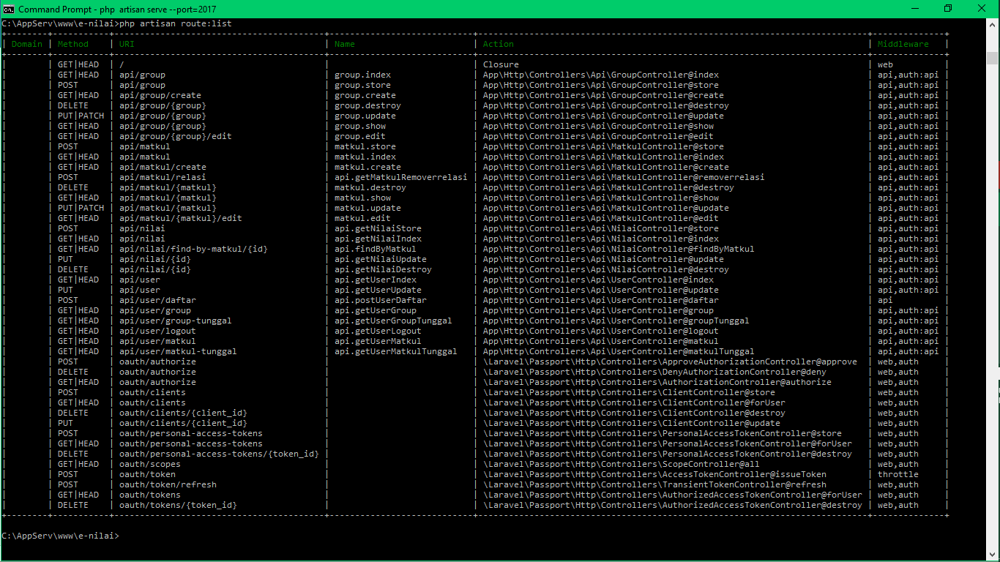

# E-Nilai 
Fitri Syukriasari - 2014150097  
Gustiani Salimah - 2014150088 

# Install

1. Laravel  
rename .env.example to .env  
composer update / composer install  
php artisan key:generate  
php artisan serve --port=8081  

2. Angular  
npm install  
ng serve  

3. Mobile  
Develop with Android Studio  
Edit URL = http://l127.0.0.7:8081/api  
------------------------------------------------------
# Route API  
ALL END POINTS   
