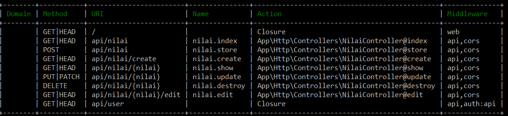

# E-Nilai
Sebuah aplikasi yang memberikan solusi secara efisisen, dinamis dan realtime.  
Diperuntukkan untuk mahaguru dalam menginputkan nilai mahasiswa.  
Nilai dilihat lewat frontend Angular dan penginputan lewat mobile yang didevelop menggunakana IDE Android Studio berbasis Java.  
Backend menggunakan framework Laravel.  

# Team
Fitri Syukriasari - 2014150097  
Gustiani Salimah - 2014150088 

# Install

check IP Address via command prompt 
ipconfig   
look address ipv4   
with wifi theatering  
example ipadress : 192.168.43.110   

1. Laravel  
rename .env.example to .env  
composer update / composer install  
php artisan key:generate  
php artisan serve --host 0.0.0.0  
URL : http://ipaddress:8000 (port default)  

2. Angular  
npm install  
edit url nilai service http://ipaddress:8000  
ng serve  

3. Mobile  
Develop with Android Studio  
Edit URL = http://ipaddress:8000/api  

# Route API  
ALL END POINTS   
  

# Screenshots
  
  
  
  
